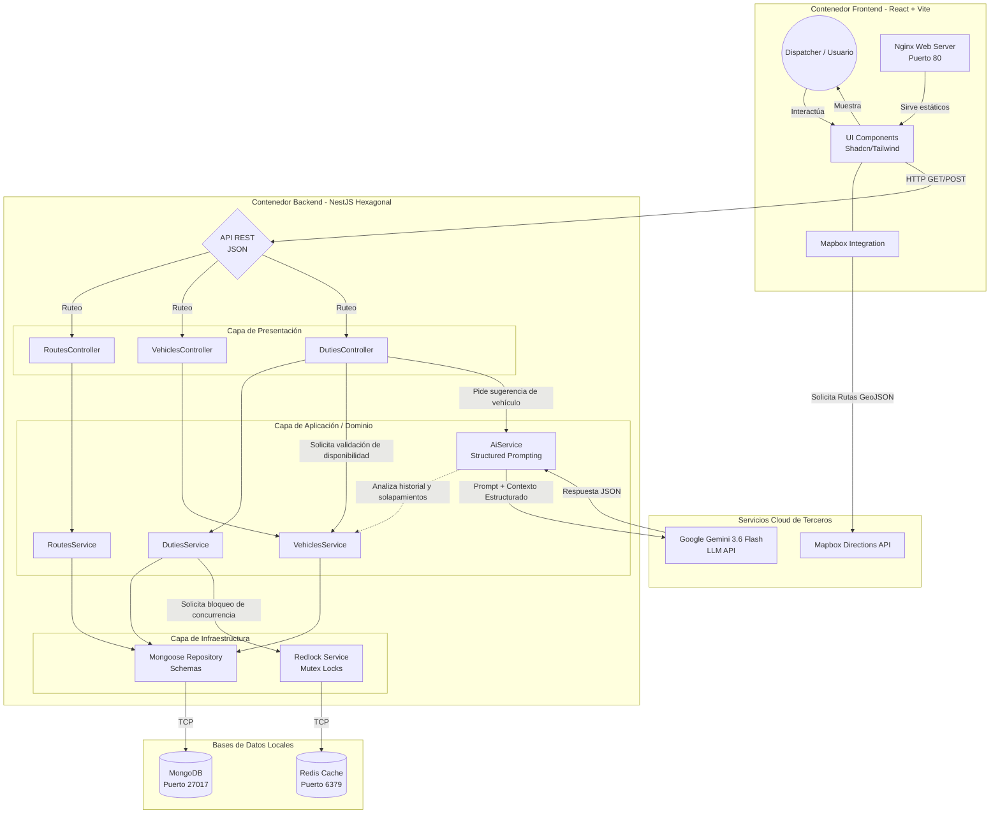

# Arquitectura del Sistema: Wawa Transport MVP

A continuación se detalla la arquitectura de alto nivel y el flujo de datos (entradas y salidas) del sistema, aplicando los principios de la **Arquitectura Hexagonal**.

## Diagrama de Componentes y Flujo de Datos

## Descripción de Componentes Clave

1. **El Usuario (Dispatcher):** Interactúa a través de su navegador cargando el frontend servido por Nginx. Ve un mapa renderizado por Mapbox.
2. **Asignación Inteligente (El Flujo Principal):**
   - El Dispatcher solicita sugerencias para un viaje a través de la UI.
   - La petición llega al `DutiesController` en el backend.
   - El `AiService` recopila el contexto: Vehículos de la flota y sus *Duties* actuales (obtenidos a través del `VehiclesService` desde MongoDB).
   - El `AiService` inyecta este contexto estructurado en el modelo `Gemini 3.6 Flash` pidiéndole que razone las superposiciones horarias.
   - Gemini devuelve un ID validado.
3. **El Mecanismo de Seguridad (Redlock):**
   - Una vez confirmada la asignación, el request pasa por el `RedlockService`.
   - Se solicita un "candado" en **Redis** para ese Vehículo en particular.
   - Si otro usuario intentó asignar el mismo vehículo en la misma fracción de segundo, el bloqueo distribuido en Redis arroja una excepción (Conflict 409), garantizando la protección de los datos antes de hacer el `save()` en **MongoDB**.

Esta separación por capas (Presentación -> Aplicación -> Infraestructura -> Bases de Datos) garantiza que el núcleo logístico de la aplicación no se ensucie con la sintaxis de Mongoose o las integraciones externas de IA, facilitando testing y evolución futura.
